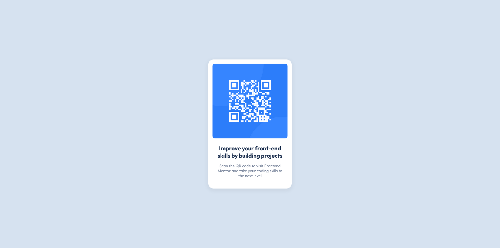

# Frontend Mentor - QR code component solution

This is a solution to the [QR code component challenge on Frontend Mentor](https://www.frontendmentor.io/challenges/qr-code-component-iux_sIO_H). Frontend Mentor challenges help you improve your coding skills by building realistic projects. 

## Table of contents

- [Overview](#overview)
  - [Screenshot](#screenshot)
  - [Links](#links)
- [My process](#my-process)
  - [Built with](#built-with)
  - [What I learned](#what-i-learned)
  - [Useful resources](#useful-resources)
- [Author](#author)

**Note: Delete this note and update the table of contents based on what sections you keep.**

## Overview

### Screenshot

### Links

- Solution URL: [Add solution URL here](https://github.com/Eorana/QR-Code/)
- Live Site URL: [Add live site URL here](http://Eorana.github.io/QR-Code)

## My process

### Built with

- Semantic HTML5 markup
- CSS custom properties
- Flexbox

### What I learned

First try with PerfectPixel, it was very usefull.

### Useful resources

- [PerfectPixel by WellDoneCode](https://chrome.google.com/webstore/detail/perfectpixel-by-welldonec/dkaagdgjmgdmbnecmcefdhjekcoceebi) - Very usefull Chrome extension for integration
- [Box-Shadow CSS Generator](https://html-css-js.com/css/generator/box-shadow/) - Because it's easier, faster and better than handwriting it

## Author

- Website - [Eorana Moor](https://eorana.fr)
- Frontend Mentor - [@Eorana](https://www.frontendmentor.io/profile/Eorana)
